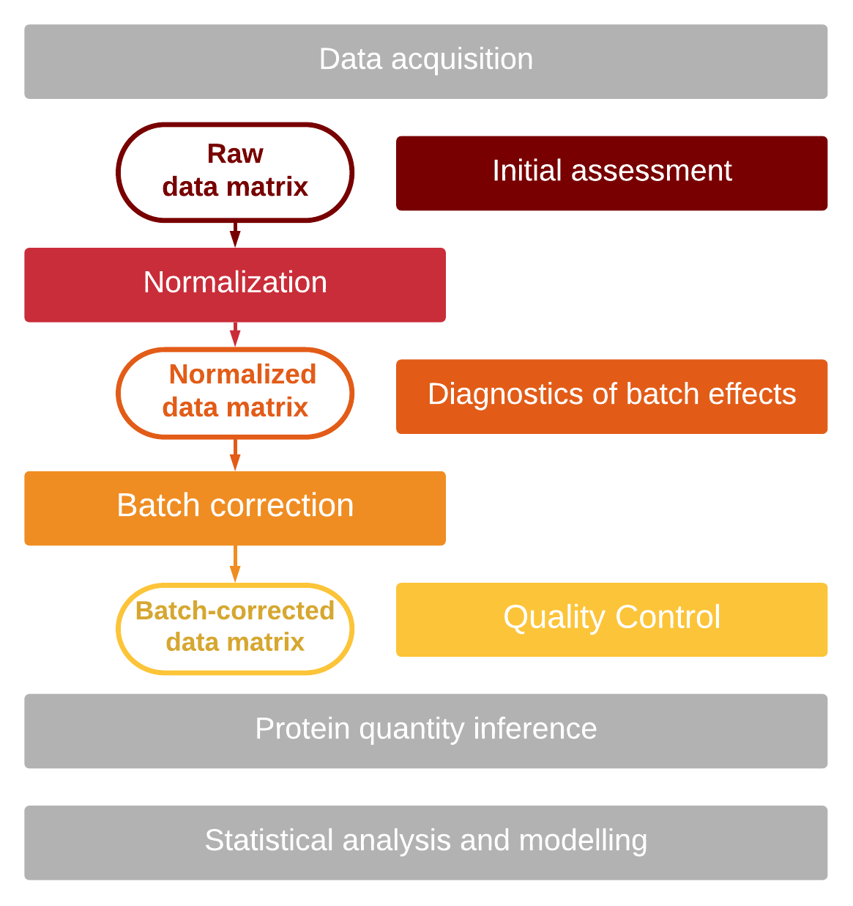
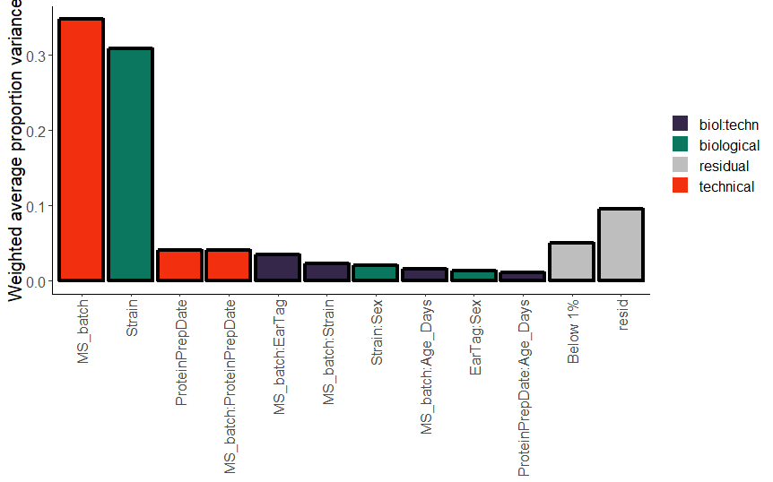

```{r global_options, include=FALSE}
knitr::opts_chunk$set(echo=TRUE, warning=FALSE, message=FALSE, fig.pos = 'h')
```

```{r setup, include = FALSE}
chooseCRANmirror(graphics=FALSE, ind=1)
knitr::opts_chunk$set(
  collapse = TRUE,
  comment = "#>"
)
```

# Introduction

## Batch effects in large-scale data.
Recent advances in mass-spectrometry enabled fast and near-exhaustive 
identification and quantification of proteins in complex biological samples [1],
which allows to profile large-scale datasets. 
Obtaining sufficiently large dataset is, however, associated with considerable 
logistics efforts of multiple biomaterial handlers on sample preparation and 
data acquisition steps e.g. protein extraction, peptide digestion, instrument cleaning. 
This introduces systematic technical variation known as the batch effects.

Batch effects can alter or obscure the biological signal in the data [2, 3]. 
Thus, the data should be analyzed for presence and severity of batch effects, and,
if necessary, corrected for.

##Batch effects analysis workflow.

The fundamental objective of the batch effect adjustment procedure is to make all 
measurements of samples comparable for a meaningful biological analysis. Normalization
brings the measurements into the same scale. Bias in the data, however, can persist 
even after normalization, as batch effects might affect specific features (peptides, genes) 
thus requiring additional batch correction procedures. This means, that the correction 
of technical bias has often two steps: normalization and batch effects correction.

The improvement of the data is best assessed visually at each step of correction. 
Initial assessment sets the baseline before any correction is executed. After 
normalization, batch effects diagnostics allow to determine the severity of the 
remaining bias. Finally, the quality control step allows to determine 
whether the correction improved the quality of the data.

The pipeline, summarizing this workflow, is shown in Fig.1.

```{r, include = TRUE, fig.align = "center", echo=FALSE, fig.cap="proBatch in batch correction workflow", out.width = '50%'}

```

##Batch effects correction in the context of other steps of data analysis

We recommend users to follow this batch correction workflow to ensure all 
measurements are comparable for downstream analysis. We provide step-by-step 
illustrations to implement this workflow in the next sections of this vignette.  

Before starting the description, we give a few hints about the steps preceding and 
following batch effects analysis and correction.

It is assumed thatthe initial data processing is completed. In mass spectrometry-
based proteomics, this involves primarily peptide-spectrum matching [OpenSWATH, TPP] 
and FDR control [Isa&George papter]. 

Data filtering is commonly the next step of data processing. In context of 
batch correction, both peptide and sample filtering need to be approached with caution. 
First of all, decoy measurements should be filtered out to ensure correct sample intensity 
distribution alignment. However, non-proteotypic peptides should be retained. 
Filtering out low-quality samples,also substantially alters normalization 
and batch effects correction. The "bad" samples, usually identified by the 
total intensity of identified peptides or correlation of samples, can be removed 
either before or after the correction for technical bias. Which option is best for
a given dataset, should be decided in each case individually.

We strongly advocate not to impute missing valuea before correction (also to exclude
"requant" values, inferred from SWATH data). Imputed values either add the 
"average" measurements, or add random noise-level measurements. Both strategies
bias the mean/median estimate of the peptide and are detrimental to  both 
normalization and batch effects correction.

We suggest to perform the protein quantification after the batch effect 
correction, as the correction procedure alters the abundances of peptides and 
peptide transitions, and these abundances are critical for protein quantity inference. 
However, we do recommend to correct the technical noise at the level, which is used
to inter the proteins (thus, fragment-level for inference tools such as aLFQ or MSstats).

# Loading data and preparing annotations
```{r,echo=T, results="hide"}
# Dependencies required for installing proBatch package
bioc_deps <- c("GO.db", "impute", "preprocessCore", "pvca","sva" )
cran_deps <- c("corrplot", "data.table", "ggfortify","lazyeval", "pheatmap", "reshape2", 
               "rlang", "tidyverse","wesanderson","WGCNA") 
lapply(bioc_deps, require, character.only = TRUE)
lapply(cran_deps, require, character.only = TRUE)
```

## Installing proBatch
To install the proBatch package, the following commands can be executed in R:
```{r, fig.show='hold', eval = FALSE}
# Once the proBatch package is in Bioconductor, can easily install by: 
install.packages("proBatch") 

# Alternatively, install the development version from GitHub:
install.packages("devtools")
devtools::install_github("symbioticMe/proBatch")
```

## Loading the data 
The package typically requires three datasets: data matrix (protein/gene expression measurement), sample annotation.

- **Measurement data**, either wide or long format: The minimal information to be included is peptide IDs (annotated `peptide_group_label` in `example_proteome` data), sample IDs (`FullRunName`) and measurements (`Intensity`). Please note that the peptide and sample IDs in the dataset should match with those in the peptide and sample annotation files respectively. 
- **Peptide annotation**: Although required annotations vary from function to function, the typical minimum is peptide ID (`peptide_group_id`) and name of corresponding protein (`Gene`)
- **Sample annotation**: sample ID (`FullRunName`), batch (`MS_batch`), chronological order of measurements (`order`) at minimum and relevant technical / biological covariates (e.g. `RunDate`, `RunTime`, `EarTag`, `Strain`, `Diet`,     `Sex`). 

Of note, our package contains function to denote order from RunDate and RunTime and generate peptide annotation file from OpenSWATH output (demonstrated in 2.3). 

The example data included in the package is a reduced OpenSWATH output file generated from BXD mouse aging study. We selected this dataset for illustration, as the most complicated scenario for batch correction with both discrete and continuous drifts. In this study, liver proteome of mouse from BXD reference population have been profiled to identify proteome changes associated with age. The animals of each strain were subjected to Chow and High-Fat Diet and sacrificed at different time points. Samples were randomized with respect to biological covariates (age, diet, sex) and two samples were injected every 10-15 samples to control for signal consistency. Samples were digested in four batches. Due to deteriorating mass-spectra acquisition, data acquisition was interrupted for machine cleaning and tuning six times, resulting in 7 mass spectrometry batches. To allow evaluation of mass spectrometry batch effect, 10 samples profiled at the end of batch 3 were profiled again after machine tuning. In total, 371 samples were used for the analysis. 

The example SWATH data and annotation files can be loaded from the package with the function `data()`. 	
```{r, fig.show='hold'}
library(proBatch)
data("example_proteome", "example_sample_annotation", "example_peptide_annotation", 
     package = "proBatch")

sample_annotation <- example_sample_annotation
peptide_annotation <- example_peptide_annotation
```

## Prepare peptide and sample annotations 
If you have peptide and sample annotations ready, you can skip this section. 

To facilitate the preparation of peptide/ sample annotation, we provide a few utility functions. From OpenSWATH ouput, you can generate peptide annotation using `create_peptide_annotation()` by denoting peptide ID in `feature_id_col` and annotation columns in `annotation_col`. 
```{r, fig.show='hold'}
generated_peptide_annotation <- create_peptide_annotation(example_proteome, 
                                        feature_id_col = 'peptide_group_label',
                                        annotation_col = c('RT', 'Intensity', "ProteinName"))
```

To facilitate specifying the order of samples by MS runs, we provide function to infer sample order by comparing date and time that the measurements were made. You can specify the columns illustrating date and time in `time_column` and their formats in `dateTimeFormat`.  
```{r, fig.show='hold'}
generated_sample_annotation <- date_to_sample_order (sample_annotation,
                                          time_column = c('RunDate','RunTime'),
                                          new_time_column = 'generated_DateTime',
                                          dateTimeFormat = c("%b_%d", "%H:%M:%S"),
                                          new_order_col = 'generated_order',
                                          instrument_col = NULL)
library(knitr)
kable(generated_sample_annotation[1:5,] %>%
  select(c("RunDate", "RunTime", "order", "generated_DateTime", "generated_order")))
```

The new time and order columns have been generated. Note that the generated_order have the same order as the manually annotated order column. 

\pagebreak

# Initial assessment of raw data matrix 
Before you proceed with any normalization or batch correction steps, you should first visualize how global quantitative patterns look like in the raw data matrix. In many cases, batch effect will be manifested as distinct trends in mean plots or a shift of total distribution in boxplots. 

The following plotting tools expect data in either data matrix or long data frame formats. Our package provides the helper functions `long_to_matrix()` and `matrix_to_long()` to conveniently convert datasets back and forth. 

## Plot sample mean 
The plot_sample_mean illustrates global average vs. sample order. This can be helpful to visualize the global quantitative pattern and identify discrepancies within or between batches. 
```{r, fig.show='hold', fig.width=5, fig.height=2}
raw_matrix <- long_to_matrix(example_proteome)
log_transformed_matrix <- log_transform(raw_matrix)
plot_sample_mean(log_transformed_matrix, sample_annotation, order_col = 'order', 
                 batch_col = "MS_batch", color_by_batch = T, ylimits = c(12, 16))
```

We can clearly see down-sloping trends in the BXD aging dataset. In fact, during the data acquisition, the mass-spectrometer had to be interrupted several times for tuning and/or column exchange as the signal was decreasing. 

\pagebreak

## Plot boxplots
Alternatively, `plot_boxplots()` captures the global distribution vs. the sample running order.
```{r, fig.show='hold', fig.width=10, fig.height=5}
log_transformed_long <- matrix_to_long(log_transformed_matrix)
plot_boxplot(log_transformed_long,  sample_annotation, batch_col = 'MS_batch')
```

In many cases, global quantitative properties such as sample medians or standard deviations won’t match. The initial assessment via mean plots or boxplots can capture such information and hint at which normalization method is better suitable. If the distributions are comparable, methods as simple as global median centering can fix the signal shift, while quantile normalization can help in case of divergent distributions. 

\pagebreak

# Normalization: quantile or median normalization
Regardless of batch effects, all high-throughput datasets should go through a normalization step to ensure measurements are comparable to one another. This package provides two options for normalization: quantile and median normalizations. 

## Quantile normalization
In principle, quantile normalization sets different distributions of individual samples to the same quantiles, which forces the distribution of the raw signal intensities to be the same in all samples. This method is widely used and recommended in practice as being robust to non-normal errors and resistant to outliers. Quantile normalization is a well-established and interpretable method to be used as a good first choice.

In proBatch::normalize, you can log transform the data matrix before normalization by `log = 2` or `log = 10`, otherwise default is `log = NULL`. You can denote quantile normalization as `normalizeFunc = "quantile"`. 
```{r, fig.show='hold'}
quantile_normalized_matrix = proBatch::normalize(raw_matrix, 
                                                 normalizeFunc = "quantile", log = 2)
```

## Median normalization 
On the other hand, if the samples already have comparable distributions or a conservative approach is preferred, users can normalize by median centering. Median normalization will simply shift medians, but will not correct for discrepancies in distributions. 
```{r, fig.show='hold'}
median_normalized_matrix = proBatch::normalize(raw_matrix, 
                                               normalizeFunc = "medianCentering", log = 2)
```

After quantile or median normalization, you can easily check if the global pattern improved by generating mean or boxplots and comparing them side by side. Here are the mean plots before and after normalization of the log transformed dataset. 
```{r, fig.show='hold', fig.width=5, fig.height=2}
plot_sample_mean(quantile_normalized_matrix, sample_annotation, 
                 color_by_batch = T, ylimits = c(12, 16))
```

\pagebreak

# Diagnostic of batch effects on normalized data matrix 
Now is the time to diagnose for batch effects and evaluate to what extent technical variance still exists in the  normalized data matrix. The positive effect of normalization is sometimes not sufficient to control for peptide and protein-specific biases associated with a certain batch source. These biases can be identified via diagnostic plots. Here we describe our essential toolbox of batch effect diagnostic approaches. Note that sample annotation and/or peptide annotation are necessary for the implementation of these plots. 

## Hierarchical clustering
Hierarchical clustering is an algorithm that groups similar samples into a tree-like structure called dendrogram. Similar samples cluster together and the driving force of this similarity can be visualized by coloring the leaves of the dendrogram by technical and biological variables. 

Our package provides `plot_sample_clustering()` and `plot_heatmap()` to plot the dendrogram by itself or with a heatmap. You can easily color annotations on the leaves of the dendrograms or heatmaps to identify what is the driving force of clustering. For color annotation, you first assign colors to biological and technical covariates by `sample_annotation_to_colors()`. Simply denote columns whether they are factoric, non-factoric or numeric to specify colors into qualitative or sequential color scales. 

```{r, fig.show='hold'}
colors_list <- sample_annotation_to_colors (sample_annotation, 
       factor_columns = c('MS_batch','EarTag', "Strain", "Diet", "digestion_batch", "Sex"),
       not_factor_columns = 'DateTime',
       numeric_columns = c('Age_Days', 'order'))
```

Once your color annotation is ready, for the specific covariates of interest, you can subset the color dataset and feed it into the clustering functions.
```{r, fig.show='hold', fig.width=10, fig.height=5}
color_df <- colors_list$color_df
covariate_col <- c("MS_batch",  "digestion_batch", "Diet")
color_covariates <- subset(color_df, select=covariate_col)

#Plot clustering between samples 
plot_hierarchical_clustering(quantile_normalized_matrix, color_covariates,  
                             distance = "euclidean", agglomeration = 'complete',
                             label_samples = F)
```

Similarly, you can plot a heatmap by supplementing the color list. You decide whether to show annotations in the column, row or both by specifying required covariates in `sample_annotation_col`, `sample_annoation_row`, or both. 
```{r, fig.show='hide',eval = FALSE}
plot_heatmap(quantile_normalized_matrix, sample_annotation, 
                         sample_annotation_col = c("MS_batch", "Diet", "Strain"), 
                         cluster_cols = T, annotation_color_list = colors_list)
```

From the clustering analysis, we can clearly see that the driving force behind sample clustering is the MS batch.

## Principal component analysis (PCA)
PCA is a technique that identifies the leading directions of variation, known as principal components. The projection of data on two principal components allows to visualize sample proximity. This technique is particularly convenient to assess replicate similarity.

You can identify the covariate leading the direction of variations by coloring potential candidates. 
```{r, fig.show='hold',  fig.width=3.4, fig.height=2.3}
plot_PCA(quantile_normalized_matrix, sample_annotation, color_by = 'MS_batch', 
              plot_title = "MS batch")
plot_PCA(quantile_normalized_matrix, sample_annotation, color_by = "digestion_batch", 
         plot_title = "Digestion batch")
plot_PCA(quantile_normalized_matrix, sample_annotation, color_by = "Diet",  
         plot_title = "Diet")
```

By plotting the first two principal components and applying different color overlaps, we see once again that clusters overlap nicely with MS batches.

## Principal variance component analysis (PVCA)
The main advantage of this approach is the quantification of the variance, associated with both technical and biological covariates. Briefly, principal variance component analysis uses a linear model to match each principal component to the sources of variation and weighs the variance of each covariate by the eigenvalue of the PC [19]. Thus, the resulting value reflects the variance explained by that covariate. 

```{r, fig.show='hold', eval = FALSE}
pvca <- plot_PVCA(quantile_normalized_matrix, sample_annotation, 
                  technical_covariates = c('MS_batch', 'digestion_batch'),
                  biological_covariates = c('EarTag', 'Strain', "Diet", "Sex", "Age_Days"))
```

```{r, include = TRUE, fig.align = "center", echo=FALSE, out.width = '80%'}

```

The biggest proportion of variance in peptide measurement was derived from mass spectrometry batches. In typical experiment, the overall magnitude of variances coming from biological factors should be high while technical variance should be kept at minimum^[Application of hierarchical clustering, PCA and PVCA in their classical implementation is not possible if missing values are present in the matrix. It has been noticed previously that missing values can be associated with technical bias [20], and most commonly, it is suggested that missing values need to be imputed [20 -21]. However, we would like to suggest to use missing value imputation with extreme caution. First of all, missing value imputation alters the sample proximity. Additionally, imputed missing values, which can be obtained for SWATH data, can alter the correction of the batches.].

## Feature level iRTs
In proteomics, peptide-level diagnostics is particularly useful. In mass-spectrometry, the samples are ordered naturally by the sequence of mass-spectrometry runs. Thus, the trends associated with this order can be assessed. The researcher can visualize the quantities of the peptides that are expected to be constant - primarily spike-in peptides. In most DIA datasets iRT peptides [22] are added in controlled quantities and can be used for this purpose.

Through our package, the `plot_spike_ins()` and `plot_peptides_of_one_protein()` allow plotting peptides of spike-ins or any protein of interest e.g. a biologically well understood protein. For implementation, specify the name column containing the protein names in `protein_col`, and spike-in or protein of interest at `spike_ins` or `protein_name`. 

```{r, fig.show='hold'}
quantile_normalized_long <- matrix_to_long(quantile_normalized_matrix, sample_annotation)
plot_spike_in(quantile_normalized_long, sample_annotation, 
              peptide_annotation = peptide_annotation,
              protein_col = 'Gene', spike_ins = "BOVINE_A1ag", 
              plot_title = 'Spike-in BOVINE protein peptides')

```

It is clear that while the pre-determined quantities of spike-ins or peptides of known biology have their expected intensities, the trend is dominated by mass spectrometry signal drift. After confirming either continuous or discrete batch effects exist in a dataset, by one or more of these methods, proceed by selecting a batch correction method. 

\pagebreak

# Batch correction 
Depending on the type of batch effect, different batch correction methods should be implemented. If there is continuous drift but only discrete discrepancies between batches, proceed with ComBat or median-centering. Otherwise, start from continuous drift correction. 

## Continuous drift correction: LOESS regression fitting 
A key feature of this package is a novel procedure to correct for continuous drift within one batch. We developed a new procedure based on nonlinear LOESS fitting to correct for MS signal drift. For each peptide and each batch, a non-linear trend is fitted to the normalized data and this trend is subtracted to correct for within-batch variation. Note that the resulting data are not batch-free as within-batch means and variances are batch-dependent. However, now the batches are discrete and thus can be corrected by ComBat or median-centering. 

```{r, fig.show='hold', fig.width=5, fig.height=2.4}
loess_fit <- normalize_custom_fit(quantile_normalized_matrix, sample_annotation)
loess_fit_matrix <- loess_fit$data_matrix
```

One important parameter in loess fitting is span, which determines the number of data points utilized for curve fitting. The loess span ranges from 0 to 1 and essentially controls the degree of smoothing. The greater the value of span, the smoother is the fitted curve. Since we want the curve to reflect signal drift, we want to avoid overfitting and potentially removing all biological variance as well. 

```{r, fig.show='hold', fig.width=5, fig.height=2.4}
loess_fit_30 <- normalize_custom_fit(quantile_normalized_matrix, sample_annotation, span = 0.3)

quantile_normalized_long <- matrix_to_long(quantile_normalized_matrix)
plot_with_fitting_curve(pep_name = "10231_QDVDVWLWQQEGSSK_2", 
            df_long = quantile_normalized_long, sample_annotation, color_by_batch = T,
            fit_df = loess_fit_30$fit_df, plot_title = "Span = 30%")
```

```{r, fig.show='hold', fig.width=5, fig.height=2.4}
loess_fit_70 <- normalize_custom_fit(quantile_normalized_matrix, sample_annotation, span = 0.7)
plot_with_fitting_curve(pep_name = "10231_QDVDVWLWQQEGSSK_2", 
            df_long = quantile_normalized_long, sample_annotation, color_by_batch = T,
            fit_df = loess_fit_70$fit_df, plot_title = "Span = 70%")
```

Another parameter of `normalize_custom_fit()` is the absolute and relative threshold on the number of missing values for each peptide. For peptides with many missing values or irregular measurements, fitting a curve may introduce unwanted bias and harm protein inference. To prevent this from happening, we filter by absolute threshold (number of total measurements per batch for each peptide, `abs.threshold`) and relative threshold (percentage of peptide measurements missing per batch, `pct.threshold`). 

## Discrete batch correction: combat or peptide-level median centering 
Once the data are normalized and corrected for continuous drift, only discrete batch effect is left to be corrected. 

### ComBat
ComBat is well-suited for batches with distinct distributions,  but restricted to those with a low number of missing values. ComBat, uses parametric and non-parametric empirical Bayes framework for adjusting data for batch effects [23]. The sva::ComBat function can incorporate both technical and biological covariates and make data comparable across batches. However, in our implementation, we are cautious about introducing biological covariates that can potentially bias towards biolocal variance. Thus, no biological covariates are fed to the algorithm in order to stay conservative for biological analysis. 

```{r, fig.show='hold'}
comBat_matrix <- correct_with_ComBat(loess_fit_matrix, sample_annotation)
```

We selected a spike-in peptides with a significant drift "46213_NVGVSFYADKPEVTQEQK_2" for illustration. 
```{r, fig.show='hold',  fig.width=3, fig.height=2.4}
loess_fit_df <- matrix_to_long(loess_fit_matrix)
combat_df <- matrix_to_long(comBat_matrix)
plot_single_feature (pep_name = "46213_NVGVSFYADKPEVTQEQK_2", loess_fit_df, 
          sample_annotation, plot_title = "Loess Fitted", color_by_col = NULL)
plot_single_feature (pep_name = "46213_NVGVSFYADKPEVTQEQK_2", combat_df, 
          sample_annotation, plot_title = "ComBat corrected", color_by_col = NULL)
```

ComBat fixed the discrete batch effect and also made distributions between batches similar to one another. 

###	Peptide-level median centering 
On the other hand, for batches with similar distributions (or when wanting to retain distinct distributions) or for datasets with many missing values (NAs or NaNs), a simpler approach should be applied. Peptide-level median centering will even intensities from different batches. Discrete batch effect will be corrected while maintaining distributions constant. 
```{r, fig.show='hold', fig.width=3, fig.height=2.4}
peptide_median_df <- equalize_peptide_batch_medians(loess_fit_df, sample_annotation)
plot_single_feature(pep_name = "46213_NVGVSFYADKPEVTQEQK_2", df_long = peptide_median_df, 
            sample_annotation, color_by_col = NULL, measure_col = 'Intensity_normalized',
            plot_title = "Feature-level Median Centered")
```

##	Correct batch effect 
We provide a convenient all-in-one function for batch correction. This function will apply loess regression fitting and discrete batch correction. Simply denote what discrete correction method is preferred at `discreteFunc` either “ComBat” or “MedianCentering” and supplement other arguments such as `span`, `abs.threshold` or `pct.threshold` as in `normalize_custom_fit()`. 

```{r, fig.show='hold'}
batch_corrected_matrix <- correct_batch_trend(data_matrix = quantile_normalized_matrix, 
                                  sample_annotation, discreteFunc = 'ComBat',
                                  abs.threshold = 5, pct.threshold = 0.20)
```

\pagebreak

# Quality control on batch-corrected data matrix 
In most cases, the batch effect correction method is evaluated by its ability to remove technical confounding, visible on hierarchical clustering or PCA. However, it is rarely shown whether the biological signal is not destroyed, or, better even, improved. Often, increased number of differentially expressed genes is presented as an improvement. However, every reasonably designed experiment has replicates that can serve as an excellent control. In addition, peptides within a given protein should behave similarly and correlation of these peptides should improve after batch correction. 

## Correlation distribution of samples
For example, in the mice aging experiment, biological replicates, ET1506 and ET1524, were injected every 30-40 MS runs. The correlation between these biological replicates should improve after normalization and batch correction. 

The `plot_sample_corr_distribution()` plots correlation distribution between biological replicates and non-replicates in the same or differnet batches by `plot_param = 'batch_replicate'`. Alternatively, you can compute the correlation between different batches by `plot_param = 'batches'`. 

It should be noted, however, that the comparison of sample correlation should be approached with the comparison of distributions, rather than by evaluating the individual examples of within-replicate vs within-batch corrections. The sample correlation is often used to prove the quality of the measurement, as it is typically very high (examples of the replicate correlation above .95 are common for mass spectrometry). However, unless these examples are shown in the context of the whole distribution structure, they can lead to erroneous conclusion. 
```{r, fig.show='hold', fig.width=3.2, fig.height=3.5}
sample_cor_norm <- plot_sample_corr_distribution(quantile_normalized_matrix, sample_annotation, 
       batch_col = 'MS_batch', plot_title = 'Quantile normalized', plot_param = 'batch_replicate')
sample_cor_norm + theme(axis.text.x = element_text(angle = 45, hjust = 1)) + ylim(0.7,1)

sample_cor_batchCor <- plot_sample_corr_distribution(batch_corrected_matrix, sample_annotation, 
       batch_col = 'MS_batch', plot_title = 'Batch corrected', plot_param = 'batch_replicate')
sample_cor_batchCor + theme(axis.text.x = element_text(angle = 45, hjust = 1)) + ylim(0.7, 1)

```

## Correlation distribution of peptides within and between proteins 
Especially for proteins of biological significance, peptides of the same protein should behave similarly in expression level. Therefore, we can compare peptide correlation before and after batch correction if the correlation between the same proteins increases while that of different proteins stays the same. 
```{r, fig.show='hold',fig.width=3, fig.height=2.5}
peptide_cor_norm <- plot_peptide_corr_distribution(quantile_normalized_matrix, 
          peptide_annotation, protein_col = 'Gene', plot_title = 'Quantile normalized')
peptide_cor_norm + geom_hline(yintercept=0, linetype="dashed", color = "grey")

peptide_cor_batchCor <- plot_peptide_corr_distribution(batch_corrected_matrix, 
          peptide_annotation, protein_col = 'Gene', plot_title = 'Batch corrected')
peptide_cor_batchCor + geom_hline(yintercept=0, linetype="dashed", color = "grey")
```

##	Pheatmap of samples back to back 
In this study, 10 samples were run in the same order before and after the tuning of the mass-spectrometer, which marks the boundary between batches 2 and 3. The correlation between these replicates can be illustrated by corrplot (`flavor = 'corrplot'`) or by pheatmap (`flavor = 'pheatmap'`)

```{r, fig.show='hold', fig.height=7, fig.width=8}
library(RColorBrewer)
earTags <- c("ET1524", "ET2078", "ET1322", "ET1566", "ET1354", "ET1420", "ET2154",
             "ET1515", "ET1506", "ET2577", "ET1681", "ET1585", "ET1518", "ET1906")

# sample ID of biological replicates 
bioreplicates <- sample_annotation %>%
  filter(MS_batch == 'Batch_2' | MS_batch == "Batch_3") %>%
  filter(EarTag %in% earTags) %>%
  pull(FullRunName)

# Prepare color annotation 
color_covariates <- sample_annotation %>%
  filter(MS_batch == 'Batch_2' | MS_batch == "Batch_3") %>%
  filter(FullRunName %in% bioreplicates) %>%
  remove_rownames %>% 
  column_to_rownames(var="FullRunName") %>%
  select("MS_batch", "EarTag") # Annotate MS_batch and EarTag on pheatmap 

# Plot pheatmap 
breaksList <- seq(0.7, 1, by = 0.01) # color scale of pheatmap 
plot_sample_heatmap(quantile_normalized_matrix, annotation_col = color_covariates, 
    samples_to_plot = bioreplicates, flavor = 'pheatmap', 
    color = colorRampPalette(rev(brewer.pal(n = 7, name = "RdYlBu")))(length(breaksList)),
    breaks = breaksList, plot_title = 'Quantile Normalized', cluster_rows=F, cluster_cols=F,
    annotation_names_col = TRUE, annotation_legend = TRUE, show_colnames = F)
```

\pagebreak

```{r, fig.show='hold', fig.height=7, fig.width=8}
plot_sample_heatmap(batch_corrected_matrix, annotation_col = color_covariates,
    samples_to_plot = bioreplicates, flavor = 'pheatmap', 
    color = colorRampPalette(rev(brewer.pal(n = 7, name = "RdYlBu")))(length(breaksList)),
    breaks = breaksList, plot_title = 'Batch Corrected', cluster_rows=F, cluster_cols=F,
    annotation_names_col = TRUE, annotation_legend = TRUE, show_colnames = F)
```
It is clear that before the correction, samples from one batch cluster better than between the replicates. However, after the correction, the correlation between replicates becomes higher than the correlation between non-related samples regardless of the batch. 

# References
[1] O. T. Schubert, H. L. Röst, B. C. Collins, G.Rosenberger, and R. Aebersold. «Quantitative proteomics: challenges and opportunities in basic and applied research». Nature Protocols 12:7 (2017), pp. 1289–1294.

[2] E. G. Williams, Y. Wu, P. Jha et al. «Systems proteomics of liver mitochondria function». Science 352:6291 (2016), aad0189.

[3] Y. Liu, A. Buil, B. C. Collins et al. «Quantitative variability of 342 plasma proteins in a human twin population». Molecular Systems Biology 11:2 (2015), pp. 786–786.

[4] T. Sajic, Y. Liu, E. Arvaniti et al. «Similarities and Differences of Blood N-Glycoproteins in Five Solid Carcinomas at Localized Clinical Stage Analyzed by SWATH-MS». Cell Reports 23:9 (2018), 2819– 2831.e5.

[5] H. Okada, H. A. Ebhardt, S. C. Vonesch, R. Aebersold, and E. Hafen. «Proteome-wide association studies identify biochemical modules associated with a wing-size phenotype in Drosophila melanogaster». Nature Communications 7 (2016), p. 12649.

[6] J. T. Leek, R. B. Scharpf, H. C. H. C. Bravo et al. «Tackling the widespread and critical impact of batch effects in high-throughput data». Nat Rev Genet 11:10 (2010), pp. 733–739.

[7] H. S. Parker and J. T. Leek. «The practical effect of batch on genomic prediction». Statistical applications in genetics and molecular biology 11:3 (2012), Article 10.

[8] A. L. Oberg and O. Vitek. «Statistical design of quantitative mass spectrometry-based proteomic experiments». Journal of Proteome Research 8:5 (2009), pp. 2144–2156.

[9] J. Hu, K. R. Coombes, J. S. Morris, and K. A. Baggerly. «The importance of experimental design in proteomic mass spectrometry experiments: Some cautionary tales». Brie ngs in Functional Genomics and Proteomics 3:4 (2005), pp. 322–331.

[10] Y. Gilad and O. Mizrahi-Man. «A reanalysis of mouse ENCODE comparative gene expression data». F1000Research 4 (2015).

[11] M.-A. A. Dillies, A. Rau, J. Aubert et al. «A comprehensive evaluation of normalization methods for Illumina high-throughput RNA sequencing data analysis». Brief Bioinform 14:6 (2013), pp. 671–683.

[12] J. Luo, M. Schumacher, A. Scherer et al. «A comparison of batch effect removal methods for enhancement of prediction performance using MAQC-II microarray gene expression data». Pharmacogenomics Journal 10:4 (2010), pp. 278–291.

[13] W. E. Johnson, C. Li, and A. Rabinovic. «Adjusting batch effects in microarray expression data using empirical Bayes methods». Biostatistics 8:1 (2007), pp. 118–127.

[14] A. H. Sims, G. J. Smethurst, Y. Hey et al. «The removal of multiplicative, systematic bias allows integration of breast cancer gene expression datasets - improving meta-analysis and prediction of prognosis». BMC Med Genomics 1 (2008), p. 42.

[15] J. T. Leek and J. D. Storey. «Capturing heterogeneity in gene expression studies by surrogate variable analysis». PLoS Genet 3:9 (2007), pp. 1724–1735.

[16] M. Benito, J. Parker, Q. Du et al. «Adjustment of systematic microarray data biases.» Bioinformatics (Oxford, England) 20:1 (2004), pp. 105–14.

[17] C. Chen, K. Grennan, J. Badner et al. «Removing batch effects in analysis of expression microarray data: an evaluation of six batch adjustment methods». PLoS One 6:2 (2011), e17238.

[18] B. M. Bolstad, R. A. Irizarry, M. Astrand, and T. P. Speed. «A comparison of normalization methods for high density oligonucleotide array data based on variance and bias.» Bioinformatics 19:2 (2003), pp. 185–93.

[19] P. R. Bushel. pvca: Principal Variance Component Analysis (PVCA). Package version 1.18.0. 2013.

[20] Y. V. Karpievitch, A. R. Dabney, and R. D. Smith. «Normalization and missing value imputation for label-free LC-MS analysis». BMC Bioinformatics 13:Suppl 16 (2012), S5.

[21] S. Tyanova, T. Temu, P. Sinitcyn et al. «The Perseus computational platform for comprehensive analysis of (prote)omics data». Nat Methods 13:9 (2016), pp. 731–740.

[22] C. Escher, L. Reiter, B. Maclean et al. «Using iRT, a normalized retention time for more targeted measurement of peptides». Proteomics 12:8 (2012), pp. 1111–1121.

[23] A. W. B. Johnston, Y. Li, and L. Ogilvie. «Metagenomic marine nitrogen fixation–feast or famine?» Trends in microbiology 13:9 (2005), pp. 416–20.

> "Premature optimization is the root of all evil."
