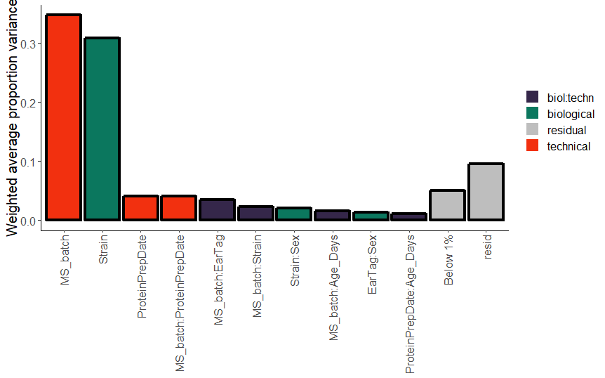

```{r global_options, include=FALSE}
knitr::opts_chunk$set(echo=TRUE, warning=FALSE, message=FALSE, fig.pos = 'h')
```

```{r include=FALSE}
require(tidyverse)
```

```{r setup, include = FALSE}
chooseCRANmirror(graphics=FALSE, ind=1)
knitr::opts_chunk$set(
  collapse = TRUE,
  comment = "#>"
)
```

# Introduction: Batch effects analysis in large-scale data
Batch effects alter or even obscure the biological signal in the data. 
Assessment and correction of batch effects is a critical step of large-scale 
data processing. This procedure aims to ensure all measumerments are comparable for downstream analysis. 
The procedure can be represented as the workflow shown in Fig 1. 

```{r batch_workflow, include = TRUE, fig.align = "center", echo=FALSE, fig.cap="Fig 1. proBatch in batch correction workflow", out.width = '40%'}
knitr::include_graphics("Batch_effects_workflow_staircase.png")
```

We illustrate each step of the workflow in the next sections. Here is the gallery of plots to be demonstrated in this vignette. 

```{r gallery, include = TRUE, fig.align = "center", echo=FALSE, out.width = '100%'}
knitr::include_graphics("plot_gallery.png")
```

One highlight of `proBatch` is the application of uniform color schemes to
different diagnostic plots. For color annotation, you first assign colors to biological and
technical covariates with `sample_annotation_to_colors()`. Using this function
columns are assigned to factoric, non-factoric or numeric types to specify
colors into qualitative or sequential color scales.

# Preparing the data for analysis

## Input data format
To analyze an experiment for batch effects, three data tables are typically required: 

1. "omics"data (data matrix), futher referred to as "measurement data"
2. sample annotation
3. feature annotation (optional) tables. 

If you are familiar with the `Biobase` package, these correspond to 1) `assayData`, 2) joined `phenoData` and 
`protocolData`, and 3)`featureData`.

**1) Measurement table**
Either a wide data matrix or long format data frame. 
In the wide (matrix) format, referred in this vignette as `data_matrix`, rows represent 
features (for proteomics, peptides/fragments) and columns represent samples. 
In the long format, referred in this vignette as `df_long`, each row is a measurement 
of a specific feature (peptide, fragment) in the specific sample. At least
three columns are required: feature ID column, measurement (intensity) column and sample ID column.

In this vignette, the essential columns have the following names:
```{r col_names}
feature_id_col = 'peptide_group_label'
measure_col = 'Intensity'
sample_id_col = 'FullRunName'
essential_columns = c(feature_id_col, measure_col, sample_id_col)
```

Note that the sample IDs (column names in `data_matrix`) should match the values of
the sample ID column in `sample_annotation` and the feature ID column values should match 
the feature annotation table (here - `peptide_annotation`). 

**2) Sample annotation**
A data frame, where one row corresponds to one sample (run/file), 
and the columns contain information on biological and technical factors. Minimally,
sample annotation has to contain a sample ID column, at least one technical and 
one biological factor column, and a biological ID column (unique ID for the biological replicate, which is repeated for each technical replicate).

In our example data, technical and biological factors are:
```{r tech_bio_cols}
technical_covariates = c('MS_batch', 'digestion_batch', 'RunDate', 'RunTime')
biological_covariates = c('Strain', 'Diet', 'Sex', 'Age_Days')
biospecimen_id_col = "EarTag"
```

**3) Feature (peptide) annotation**
A dataframe, where one row corresponds to 
one feature (in MS proteomics - peptide or fragment), and the columns are names of
proteins and corresponding genes. Thus, the minimum columns are feature ID (`peptide_group_id`) 
and name of corresponding protein (in this vignette, we use `Gene` name).

## Example dataset

As the example dataset, we include a SWATH-MS proteomic measurement data, obtained from a BXD mouse aging
study. Refer to extended vignette for the detailed description of the dataset. 

The example SWATH data and annotation files can be loaded from the package with the function `data()`. 	
```{r load_data, fig.show='hold'}
library(proBatch)
data("example_proteome", "example_sample_annotation", "example_peptide_annotation", 
     package = "proBatch")
```

From openSWATH output, we prepare data matrix compatible for initial assessment by converting 
long data frame format to data matrix and log transform intensity values. 
```{r transform_data, fig.show='hold'}
example_matrix <- long_to_matrix(example_proteome)
log_transformed_matrix <- log_transform(example_matrix)
```

## Preparing sample and peptide annotations 
`proBatch` provides utility functions to facilitate the preparation of
sample and peptide annotation. These include `date_to_sample_order()`, 
`create_peptide_annotation()`, `long_to_matrix()`, `log_transform()`and etc. 
Please refer to detailed vignette for examples. 

# Step-by-step workflow
Now we provide step-by-step workflow for dataset containing both continuous and discrete batch effects. 

## Initial assessment of the uncorrected data  
Before any correction, it is informative to set the baseline of the data quality 
by examining global quantitative patterns in the raw data matrix.
Commonly, batch effects manifest as batch-specific intensity distribution changes.

### Inspecting boxplots {#boxplot}
Plotting boxplots demonstrate the global distribution of data samples. 
```{r plot_boxplots, fig.show='hold', fig.width=8, fig.height=4}
batch_col = 'MS_batch'

color_scheme <- sample_annotation_to_colors(example_sample_annotation, 
       factor_columns = c('MS_batch','EarTag', "Strain", "Diet", "digestion_batch", "Sex"),
       not_factor_columns = 'DateTime',
       numeric_columns = c('order'))
color_list = color_scheme$list_of_colors

log_transformed_long <- matrix_to_long(log_transformed_matrix)
plot_boxplot(log_transformed_long, example_sample_annotation, 
             batch_col = batch_col, color_scheme = color_list[[batch_col]])
```

### Plotting the sample mean vs. running order {#meanplot}
In mass spectrometry, order-associated intensity drifts are common. It is easier to inspect them by plotting sample mean:
```{r plot_mean, fig.show='hold', fig.width=5, fig.height=2}
batch_col = 'MS_batch'
plot_sample_mean(log_transformed_matrix, example_sample_annotation, order_col = 'order', 
                 batch_col = batch_col, color_by_batch = TRUE, ylimits = c(12, 16),
                 color_scheme = color_list[[batch_col]])
```

In this dataset, we see downward trends in the example dataset. 

In many cases, global quantitative properties such as sample medians or standard deviations won’t match.
The initial assessment via boxplots or mean plots captures discrepancies between global sample patterns
such as different sample medians or standard deviations. This guides the choice of normalization method. 
For example, global median centering equalizes sample medians but quantile normalization also 
equalizes standard deviations. 

## Normalization

To make samples comparable, they need to be brought to the same scale. This
processed is called normalization.  In `proBatch`, two normalization
approaches are implemented: median centering and quantile normalization. The
normalization function `normalize_data()` by default takes
log-transformed data, and if needed, log-transformation can be done
on-the-fly by specifying `log_base = 2` for log2-transformation.

```{r quantile_norm, fig.show='hold'}
quantile_normalized_matrix = normalize_data(log_transformed_matrix, 
                                            normalizeFunc = "quantile")
```

After normalization, user can easily check if the
global pattern improved by generating mean or boxplots and comparing
them. Here are the mean plots after normalization of the log transformed dataset.
```{r plot_mean_normalized, fig.show='hold', fig.width=5, fig.height=2}
plot_sample_mean(quantile_normalized_matrix, example_sample_annotation, 
                 color_by_batch = TRUE, ylimits = c(12, 16), 
                 color_scheme = color_list[[batch_col]])
```

## Diagnostics of batch effects in normalized data 
After normalization, batch effects can still be present in the data. 
This has to be diagnosed with methods such as PCA or hiearchical clustering (with or without heatmap). 
Moreover, the contribution of each technical and biological factor can be quantified and illustrated with PVCA 
(principal variance component analysis). Additionally, it is useful to diagnose batch effects on feature level
for example, by plotting several peptides of the same protein. We start illustrations of diagnostic plots with PCA.

### Principal component analysis (PCA)
PCA is a technique that identifies the leading directions of
variation, known as principal components. The projection of data on
two principal components allows to visualize sample proximity. This
technique is particularly convenient to assess replicate similarity.

You can identify the covariate leading the direction of variations by
coloring potential candidates.
```{r plot_PCA, fig.show='hold',  fig.width=3.5, fig.height=2.5}
plot_PCA(quantile_normalized_matrix, example_sample_annotation, color_by = 'MS_batch', 
              plot_title = "MS batch", colors_for_factor = color_list[[batch_col]])
plot_PCA(quantile_normalized_matrix, example_sample_annotation, color_by = "Diet",  
         plot_title = "Diet", colors_for_factor = color_list[["Diet"]])
```

By plotting the first two principal components and applying different
color overlaps, we see once again that the clusters overlap nicely
with the MS batches.

### Principal variance component analysis (PVCA)
The main advantage of this approach is the quantification of the
variance, associated with both technical and biological
covariates. 

**NB:** PVCA calculation is a computationally demanding procedure. For
a data matrix of several hundred samples and several thousands of
peptides it can easily take several hours.  So it is generally a
good idea to run this analysis as a stand-alone script on a powerful
machine.

```{r plot_PVCA, fig.show='hold', eval = FALSE}
pvca <- plot_PVCA(quantile_normalized_matrix, example_sample_annotation, 
                  technical_covariates = c('MS_batch', 'digestion_batch'),
                  biological_covariates = c(biological_covariates, biospecimen_id_col))
```

```{r, include = TRUE, fig.align = "center", echo=FALSE, out.width = '70%'}

```

The biggest proportion of variance in the peptide measurement was derived
from mass spectrometry batches. In a typical experiment, the overall
magnitude of variances coming from biological factors should be high
while technical variance should be kept at minimum^[Application of
hierarchical clustering, PCA and PVCA in their classical
implementation is not possible if missing values are present in the
matrix. It has been noticed previously that missing values can be
associated with technical bias [1], and most commonly, it is
suggested that missing values need to be imputed [1-2]. However, we
would like to suggest to use missing value imputation with extreme
caution. First of all, missing value imputation alters the sample
proximity. Additionally, imputed missing values, which can be obtained
for SWATH data, can alter the correction of the batches.].

### Peptide-level diagnostics and spike-ins {#feature_trend}
Feature-level diagnostics are very informative for batch effect
correction. To assess the bias in the data, one can choose a feature
(peptide, protein, gene), the quantitative behaviour of which is
known. 

In our package, `plot_peptides_of_one_protein()` allows
plotting peptides of interest e.g. from biologically well understood
protein. If spike-in proteins or peptides have been added to the
mixture, one can use the `plot_spike_ins()` function instead. In most
DIA datasets iRT peptides are added in controlled quantities and
can be visualized with the `plot_iRT()` function. In mass-spectrometry, 
the trends associated with order can be assessed for a few representative peptides, 
thus the `order` column is also important for this diagnostics.

```{r plot_spikeIn, fig.show='hold', fig.align = "center", fig.width=7, fig.height=2.7}
quantile_normalized_long <- matrix_to_long(quantile_normalized_matrix, example_sample_annotation)

BOVINE_A1ag <- c("1724_DAC(UniMod:4)GPLEK_2", "46215_NVGVSFYADKPEVTQEQKK_4")
plot_single_feature(pep_name = BOVINE_A1ag, quantile_normalized_long, example_sample_annotation,
                    color_by_batch = TRUE, plot_title = "Spike-in BOVINE protein peptides",
                    color_scheme = color_list[[batch_col]])
```

It is clear that while the pre-determined quantities of spike-ins or
peptides of known biology have their expected intensities, the trend
is dominated by mass spectrometry signal drift. After confirming
either continuous or discrete batch effects exist in a dataset, by one
or more of these methods, proceed by selecting a batch correction
method.

Note that details of other diagnostic plots can be found in extended vignette. 

## Correction of batch effects
Different batch correction methods should be applied depending on the type of batch effects: 
continuous (see fig [meanplot](#meanplot) and [feature-level plots](#feature_trend)) or discrete [boxplot](#boxplot). 
Most of the batch effect correcito methods adjusts for feature-level biases [4]. 

For continuous signal drifts, common for mass spectrometry data, we 
introduce a new correction method `adjust_batch_trend()` based on LOESS regression. 

For discrete batch effects, we implemented two methods:
1. batch median centering of each feature (`center_peptide_batch_medians`)
2. ComBat (`correct_with_ComBat`)

### Continuous drift correction 
Signal drift can be different for different peptides (refer to [feature-level plots](#feature_trend)). 
This is why for each feature, we fit a non-linear trend based on LOESS regression.

```{r loess_70, fig.show='hold', fig.width=5, fig.height=2.4}
loess_fit <- adjust_batch_trend(quantile_normalized_matrix, example_sample_annotation, span = 0.7)
loess_fit_matrix <- loess_fit$data_matrix
```

LOESS fit depends on the parameter called span, which is dataset specific. 
For more detail on span choice, refer to extended vignette.

To evaluate the goodness of fit, we plot fitting curve. 
```{r loess_fitting_curve, fig.show='hold', fig.width=5, fig.height=2.4}
plot_with_fitting_curve(pep_name = "10231_QDVDVWLWQQEGSSK_2", 
            df_long = quantile_normalized_long, example_sample_annotation, 
            color_by_batch = TRUE, color_scheme = color_list[[batch_col]],
            fit_df = loess_fit$fit_df, plot_title = "Curve fitting with Span = 70%")
```

Note that the trend is corrected but the means are still batch-dependent. However, the batch effects are discrete now and thus can be corrected using converntional methods for batch correction such as median-centering or ComBat.

### Discrete batch effects correction: ComBat or feature-level median centering 

ComBat is well-suited for batches with distinct distributions, but
restricted to peptides that don't have missing batch
measurements. ComBat, uses parametric and non-parametric empirical
Bayes framework for adjusting data for batch effects [3]. The
function `correct_with_ComBat()` can incorporate several covariates
and make data comparable across batches.

```{r comBat, fig.show='hold'}
comBat_matrix <- correct_with_ComBat(loess_fit_matrix, example_sample_annotation)
```

To illustrate the correction we use the "1724_DAC(UniMod:4)GPLEK_2" spike-in peptide. 
```{r combat_result, fig.show='hold',  fig.width=3.5, fig.height=2.5}
loess_fit_df <- matrix_to_long(loess_fit_matrix)
combat_df <- matrix_to_long(comBat_matrix)
plot_single_feature (pep_name = "1724_DAC(UniMod:4)GPLEK_2", loess_fit_df, 
          example_sample_annotation, plot_title = "Loess Fitted", color_by_col = NULL)
plot_single_feature (pep_name = "1724_DAC(UniMod:4)GPLEK_2", combat_df, 
          example_sample_annotation, plot_title = "ComBat corrected", color_by_col = NULL)
```

ComBat fixed the discrete batch effects and also made the distributions
between batches similar to one another.

Refer to extended vignette for feature-level median centering. 

###	Correct batch effects: universal function 
We provide a convenient all-in-one function for batch correction. The
function `correct_batch_effects()` corrects MS signal drift and discrete
shift in a single function call. Simply specify which discrete
correction method is preferred at `discreteFunc` either “ComBat” or
“MedianCentering” and supplement other arguments such as `span`,
`abs.threshold` or `pct.threshold` as in `normalize_custom_fit()`.

```{r batch_corr_general, fig.show='hold'}
batch_corrected_matrix <- correct_batch_effects(data_matrix = quantile_normalized_matrix, 
                                  example_sample_annotation, discreteFunc = 'ComBat',
                                  abs.threshold = 5, pct.threshold = 0.20)
```

\pagebreak

## Quality control on batch-corrected data matrix 
To ensure that batch effects were properly adjusted, it is important to control the quality of normalization and correction. 

In most cases, the batch effect adjustment is evaluated by its
ability to remove technical confounding, visible on hierarchical
clustering or PCA. However, it does not show whether the data quality improved. In `proBatch`, We introduces quality 
control metrics based on sample and peptide correlations. It is anticipated that batch effects adjustment improves replicated sample correlation and correlation of peptides of the same protein.

### Heatmap of selected replicate samples
In this study, 10 samples were run in the same order before and after
the tuning of the mass-spectrometer, which marks the boundary between
batches 2 and 3. The correlation between these replicates can be
illustrated by corrplot (`flavor = 'corrplot'`) or by "pretty
heatmap", of "pheatmap" (`flavor = 'pheatmap'`)

First, we specify, which samples we want to correlate
```{r setup_corr_heatmap, fig.show='hold', fig.height=5, fig.width=8}
earTags <- c("ET1524", "ET2078", "ET1322", "ET1566", "ET1354", "ET1420", "ET2154",
             "ET1515", "ET1506", "ET2577", "ET1681", "ET1585", "ET1518", "ET1906")

# Prepare color annotation 
factors_to_show = c("MS_batch", "EarTag")
replicate_annotation <- example_sample_annotation %>%
  filter(MS_batch == 'Batch_2' | MS_batch == "Batch_3") %>%
  filter(EarTag %in% earTags) %>%
  remove_rownames() %>% 
  column_to_rownames(var="FullRunName") %>%
  select(factors_to_show) # Annotate MS_batch and EarTag on pheatmap 

# sample ID of biological replicates 
replicate_filenames = replicate_annotation %>%
  rownames()

breaksList <- seq(0.7, 1, by = 0.01) # color scale of pheatmap 
heatmap_colors = colorRampPalette(
  rev(RColorBrewer::brewer.pal(n = 7, name = "RdYlBu")))(length(breaksList))
```

```{r corr_samples_heatmap, fig.show='hold', fig.height=3, fig.width=4.5}
# Plot the heatmap 
plot_sample_corr_heatmap(quantile_normalized_matrix, samples_to_plot = replicate_filenames, 
                         flavor = 'pheatmap', plot_title = 'Quantile Normalized', 
                         annotation_colors = color_list[factors_to_show], 
                         annotation_col = replicate_annotation,
                         color = heatmap_colors, breaks = breaksList, 
                         cluster_rows= FALSE, cluster_cols=FALSE,fontsize = 4,
                         annotation_names_col = TRUE, annotation_legend = FALSE, 
                         show_colnames = FALSE)

plot_sample_corr_heatmap(batch_corrected_matrix, samples_to_plot = replicate_filenames, 
                         flavor = 'pheatmap', plot_title = 'Batch Corrected',
                         annotation_colors = color_list[factors_to_show], 
                         annotation_col = replicate_annotation,
                         color = heatmap_colors, breaks = breaksList, 
                         cluster_rows=FALSE, cluster_cols=FALSE,fontsize = 4,
                         annotation_names_col = TRUE, annotation_legend = FALSE, 
                         show_colnames = FALSE)
```

Before the correction, samples from one batch correlate better and
of ten higher than the replicates. However, after the correction, the
correlation between replicates becomes higher than the correlation
between non-related samples regardless of the batch.

We also provide `plot_sample_corr_distribution()` function to plot correlation distribution between biological replicates and non-biological replicates in the same or different batches. Refer to extended vignette for details. 


### Correlation of peptide distributions within and between proteins 
Peptides of the same protein are likely to correlate. Therefore, we
can compare within- vs between-protein peptide correlation before and
after batch correction to check if the correlation of peptides between the same proteins
increases while that of different proteins stays the same.

**NB:** For a data matrix containing several thousands of peptides, calculation of peptide correlation 
is a computationally demanding procedure. It can easily take several hours. Therefore, it is generally 
recommended to run this analysis as a stand-alone script on a powerful machine.

Here shows peptide correlation distribution generated from a complete dataset of the BXD mouse aging
study:

```{r, include = TRUE, fig.align = "center", echo=FALSE, out.width = '60%'}

```

# SessionInfo

```{r sessionInfo, eval=TRUE}
sessionInfo()
```

# Citation

To cite this package, please use:
```{r citation}
citation('proBatch')
```


\pagebreak

# References
[1] Y. V. Karpievitch, A. R. Dabney, and R. D. Smith. «Normalization and missing value imputation for label-free LC-MS analysis». BMC Bioinformatics 13:Suppl 16 (2012), S5.

[2] S. Tyanova, T. Temu, P. Sinitcyn et al. «The Perseus computational platform for comprehensive analysis of (prote)omics data». Nat Methods 13:9 (2016), pp. 731–740.

[3] A. W. B. Johnston, Y. Li, and L. Ogilvie. «Metagenomic marine nitrogen fixation–feast or famine?» Trends in microbiology 13:9 (2005), pp. 416–20.

[4] J. T. Leek, R. B. Scharpf, H. C. H. C. Bravo et al. «Tackling the widespread and critical impact of batch effects in high-throughput data». Nat Rev Genet 11:10 (2010), pp. 733–739.